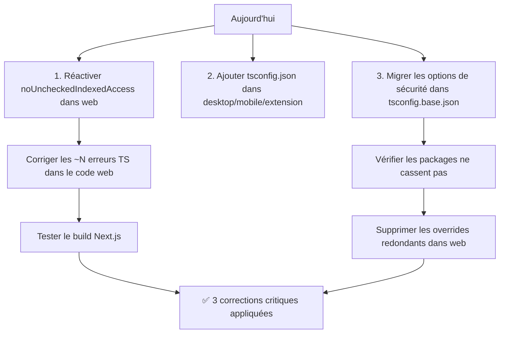

# Analyse de configuration TypeScript — SocialCreator

> **Date** : 2026-06-24
> **TypeScript** : v5.7.3
> **Projet** : Monorepo Turborepo (Next.js 14 + packages)

---

## 1. Architecture des configurations

Le projet utilise une configuration **hiérarchique** via `extends` :

```
@socialcreator/config/tsconfig.base.json   ← Base commune
    ├── socialcreator-web/tsconfig.json     ← Next.js (DOM, JSX)
    ├── packages/socialcreator-utils/tsconfig.json
    ├── packages/socialcreator-ui/tsconfig.json
    └── packages/socialcreator-types/tsconfig.json
```

**Absence de tsconfig.json** dans les sous-projets suivants :
- `socialcreator-desktop/`
- `socialcreator-mobile/`
- `socialcreator-extension/`

> ⚠️ Ces sous-projets n'ont aucun fichier `tsconfig.json` — ils dépendent soit du root `tsconfig.json` (inexistant), soit d'un éditeur qui remonte automatiquement. Cela signifie **aucune vérification TypeScript fiable** pour ces projets.

---

## 2. Analyse détaillée de chaque option

### 2.1 `strict` (mode strict global)

| Propriété | Base | Web | Utils | UI | Types |
|-----------|------|-----|-------|----|-------|
| **État** | ✅ `true` | Hérité | Hérité | Hérité | Hérité |

**Ce qu'elle change** : Active en un seul flag tout le « strict family » :
- `noImplicitAny`
- `strictNullChecks`
- `strictFunctionTypes`
- `strictBindCallApply`
- `strictPropertyInitialization`
- `noImplicitThis`
- `alwaysStrict`

**Risque si désactivé** : Le type `any` se propage silencieusement, `null`/`undefined` deviennent des valeurs acceptables partout, les erreurs de typage de fonctions passent inaperçues.

**Recommandation** : ✅ **Oui**, absolument requis pour une app production.

**Exemple de bug évité** :
```ts
// Sans strictNullChecks, ceci compile et explose à l'exécution
function getFirst(items: string[]) {
  return items[0].toUpperCase(); // Runtime: Cannot read properties of undefined
}
```

---

### 2.2 `noImplicitAny`

| Propriété | Base | Web | Utils | UI | Types |
|-----------|------|-----|-------|----|-------|
| **État** | ✅ Activé via `strict` | Hérité | Hérité | Hérité | Hérité |

**Ce qu'elle change** : Refuse les paramètres/retours dont le type ne peut pas être inféré. Empêche TypeScript de déduire `any` silencieusement.

**Risque si désactivé** : Les `any` implicites se multiplient sans que le développeur ne s'en rende compte. Un appel de fonction avec des paramètres non typés propage l'insécurité dans toute la chaîne d'appels.

**Recommandation** : ✅ **Oui**.

**Exemple de bug évité** :
```ts
// Erreur TS : Parameter 'callback' implicitly has an 'any' type
function process(callback) {
  callback(42);
}

// Le développeur est forcé d'écrire :
function process(callback: (n: number) => void) {
  callback(42);
}
```

---

### 2.3 `strictNullChecks`

| Propriété | Base | Web | Utils | UI | Types |
|-----------|------|-----|-------|----|-------|
| **État** | ✅ Activé via `strict` | Hérité | Hérité | Hérité | Hérité |

**Ce qu'elle change** : `null` et `undefined` ne sont plus assignables à tous les types. Le compilateur exige une vérification explicite avant d'utiliser une valeur potentiellement `null`/`undefined`.

**Risque si désactivé** : Cause **#1 des bugs production** en JavaScript — `Cannot read properties of null/undefined`. Impossible de détecter statiquement les accès dangereux.

**Recommandation** : ✅ **Oui**, option la plus importante après `strict`.

**Exemple de bug évité** :
```ts
interface User { name: string }
const users: Record<string, User> = {};

// Sans strictNullChecks : compile ✅, runtime 💥
console.log(users["nonexistent"].name);

// Avec strictNullChecks : erreur TS 📛
// Object is possibly 'undefined'.
```

---

### 2.4 `strictFunctionTypes`

| Propriété | Base | Web | Utils | UI | Types |
|-----------|------|-----|-------|----|-------|
| **État** | ✅ Activé via `strict` | Hérité | Hérité | Hérité | Hérité |

**Ce qu'elle change** : Rend la vérification des paramètres de fonction **contravariante** (correcte) au lieu de bivariante (permissive). C'est la différence entre un typage structurel sain et un typage qui laisse passer des affectations dangereuses.

**Risque si désactivé** : Permet d'assigner un `Array<Animal>` là où un `Array<Dog>` est attendu, ce qui peut compromettre l'intégrité des callbacks.

**Recommandation** : ✅ **Oui**.

**Exemple de bug évité** :
```ts
type AnimalHandler = (a: Animal) => void;
type DogHandler = (d: Dog) => void;

const handleDog: DogHandler = (dog: Dog) => dog.bark();

// Sans strictFunctionTypes : pas d'erreur ❌
// Avec strictFunctionTypes : erreur ✅ (un DogHandler ne peut pas être assigné là où un AnimalHandler est attendu)
const bad: AnimalHandler = handleDog; // Erreur préservée
```

---

### 2.5 `strictBindCallApply`

| Propriété | Base | Web | Utils | UI | Types |
|-----------|------|-----|-------|----|-------|
| **État** | ✅ Activé via `strict` | Hérité | Hérité | Hérité | Hérité |

**Ce qu'elle change** : Vérifie que les arguments passés à `.bind()`, `.call()`, `.apply()` correspondent bien aux paramètres de la fonction cible.

**Risque si désactivé** : `fn.call(obj, mauvaisArgs)` compile sans erreur et explose à l'exécution.

**Recommandation** : ✅ **Oui**, coût quasiment nul en prod.

**Exemple de bug évité** :
```ts
function greet(greeting: string, name: string) {
  return `${greeting}, ${name}`;
}

// Sans strictBindCallApply : compile ✅
greet.call(null, 42, true); // Runtime: "42, true" au lieu d'erreur

// Avec : erreur TS 📛
// Argument of type 'number' is not assignable to parameter of type 'string'
```

---

### 2.6 `strictPropertyInitialization`

| Propriété | Base | Web | Utils | UI | Types |
|-----------|------|-----|-------|----|-------|
| **État** | ✅ Activé via `strict` | Hérité | Hérité | Hérité | Hérité |

**Ce qu'elle change** : Vérifie que toutes les propriétés d'une classe sont initialisées dans le constructeur ou via des initializers.

**Risque si désactivé** : Une propriété déclarée non-optionnelle peut être `undefined` à l'exécution sans que le compilateur ne le détecte.

**Recommandation** : ✅ **Oui**, surtout en environnement Next.js avec des classes services.

**Exemple de bug évité** :
```ts
class DatabaseService {
  private client: DatabaseClient; // Erreur TS 📛 : n'a pas été initialisée

  constructor() {
    // Oublié de faire : this.client = new DatabaseClient();
  }

  query(sql: string) {
    return this.client.execute(sql); // Runtime 💥
  }
}
```

---

### 2.7 `noImplicitThis`

| Propriété | Base | Web | Utils | UI | Types |
|-----------|------|-----|-------|----|-------|
| **État** | ✅ Activé via `strict` | Hérité | Hérité | Hérité | Hérité |

**Ce qu'elle change** : Interdit l'utilisation de `this` dans un contexte où son type ne peut pas être inféré.

**Risque si désactivé** : Les fuites de contexte `this` (callback sans bind, perte de contexte dans React sans arrow function) passent inaperçues.

**Recommandation** : ✅ **Oui**, crucial pour React où le contexte `this` est une source fréquente de bugs.

**Exemple de bug évité** :
```ts
// Sans noImplicitThis : compile ✅ (this est any)
function onClick() {
  console.log(this.value); // this est any, pas de vérification
}

class Counter {
  value = 0;
  increment() {
    // Avec noImplicitThis : erreur 📛
    // 'this' implicitly has type 'any' because it does not have a type annotation
    setTimeout(function() {
      this.value++; // Perte de contexte !
    }, 100);
  }
}
```

---

### 2.8 `alwaysStrict`

| Propriété | Base | Web | Utils | UI | Types |
|-----------|------|-----|-------|----|-------|
| **État** | ✅ Activé via `strict` | Hérité | Hérité | Hérité | Hérité |

**Ce qu'elle change** : Émet `"use strict"` dans tout le JS compilé et parse le code en mode strict.

**Risque si désactivé** : Certaines assignations silencieuses (ex: `undefined = true`) ne sont pas bloquées, les `with` sont autorisés, etc.

**Recommandation** : ✅ **Oui**, sans impact négatif.

**Exemple de bug évité** :
```ts
// Mode non-strict : pas d'erreur
// Mode strict : ReferenceError
mistypedVariable = 42; // Crée une variable globale accidentellement
```

---

### 2.9 `useUnknownInCatchVariables`

| Propriété | Base | Web | Utils | UI | Types |
|-----------|------|-----|-------|----|-------|
| **État** | ❌ Absent | ✅ `true` | ❌ Absent | ❌ Absent | ❌ Absent |

**Ce qu'elle change** : Par défaut, `catch(e)` type `e` comme `any`. Cette option le type comme `unknown`, forçant une vérification avant d'utiliser la variable.

**Risque si désactivé** : Accès aveugle à `e.message`, `e.status`, etc. Si ce qui est `throw` n'est pas une `Error` (ex: `throw "bug"`), ça explose à son tour dans le `catch`.

**Recommandation** : ✅ **Oui**, fortement recommandé.

**⚠️ Cohérence** : Seul `socialcreator-web` active cette option. Les packages `utils`, `ui`, `types` ne l'ont pas — elle est donc **désactivée** dans les packages.

**Exemple de bug évité** :
```ts
try {
  throw "Ceci est une string, pas une Error";
} catch (e) {
  // Sans useUnknownInCatchVariables : compile ✅, runtime 💥
  console.log(e.message); // undefined — pas d'erreur TS

  // Avec useUnknownInCatchVariables : erreur TS 📛
  // 'e' is of type 'unknown'
  // Solution :
  if (e instanceof Error) {
    console.log(e.message);
  }
}
```

---

### 2.10 `exactOptionalPropertyTypes`

| Propriété | Base | Web | Utils | UI | Types |
|-----------|------|-----|-------|----|-------|
| **État** | ❌ Absent | ❌ Absent | ❌ Absent | ❌ Absent | ❌ Absent |

**Ce qu'elle change** : Les propriétés optionnelles `prop?: string` n'acceptent que `string | undefined`, **pas** `string | undefined | null`. De plus, `undefined` ne peut pas être assigné comme valeur explicite — seule l'absence de la propriété est autorisée.

**Risque si désactivé** : Distinction floue entre « propriété absente » et « propriété présente mais undefined ». Impossible de faire confiance à `Object.keys()` ou aux accès conditionnels.

**Recommandation** : ✅ **Oui** (mais peut casser beaucoup de code existant qui utilise `undefined` comme valeur).

**⚠️ Attention** : ⚠️ Nécessite des ajustements, notamment avec Prisma et React (qui utilisent souvent `undefined` explicitement). À activer progressivement.

**Exemple de bug évité** :
```ts
interface Config {
  timeout?: number;
  retry?: number;
}

const cfg: Config = { timeout: 100, retry: undefined };

// Sans exactOptionalPropertyTypes : compile ✅
// Avec : erreur 📛 — Type 'undefined' is not assignable to type 'number' with 'exactOptionalPropertyTypes: true'
// Il faut soit omit la propriété, soit la rendre number | undefined explicitement
```

---

### 2.11 `noUncheckedIndexedAccess`

| Propriété | Base | Web | Utils | UI | Types |
|-----------|------|-----|-------|----|-------|
| **État** | ✅ `true` | ✅ `false` (OVERRIDE) | Hérité ✅ | Hérité ✅ | Hérité ✅ |

**⚠️ THIS IS A CRITICAL FINDING** : La base active cette option, mais `socialcreator-web` la **désactive explicitement** avec `"noUncheckedIndexedAccess": false`.

**Ce qu'elle change** : Tout accès indexé (`arr[0]`, `obj[key]`) retourne `T | undefined` au lieu de `T`. Force une vérification d'existence avant utilisation.

**Risque si désactivé dans web** : Tous les accès aux tableaux et dictionnaires dans le code Next.js peuvent retourner `undefined` sans que TypeScript ne le signale. C'est la **source #1 de bugs production** dans les applis web React/Next.js (accès à un élément de liste inexistant, map avec clé manquante, etc.).

**Recommandation** : ✅ **Oui**, absolument, et il faut le réactiver dans web.

**Exemple de bug évité** :
```ts
const users = await db.user.findMany();

// Sans noUncheckedIndexedAccess : compile ✅
// Si users est vide, runtime 💥
console.log(users[0].name);

// Avec : erreur TS 📛
// 'users[0]' is possibly 'undefined'
if (users[0]) {
  console.log(users[0].name); // ✅
}
```

**Pourquoi il a été désactivé ?** Probablement à cause de trop d'erreurs TS dans le codebase lors de l'ajout. La bonne approche est de réactiver et **corriger les erreurs une par une** avec des `if` guards.

---

### 2.12 `noImplicitOverride`

| Propriété | Base | Web | Utils | UI | Types |
|-----------|------|-----|-------|----|-------|
| **État** | ❌ Absent | ✅ `true` | ❌ Absent | ❌ Absent | ❌ Absent |

**Ce qu'elle change** : Exige le mot-clé `override` sur les méthodes qui redéfinissent une méthode de classe parente.

**Risque si désactivé** : Un renommage ou une suppression de méthode dans la classe parente n'est pas détecté. La « surcharge » devient silencieusement une méthode indépendante.

**Recommandation** : ✅ **Oui**.

**⚠️ Cohérence** : Seul web l'active. Les packages ne l'ont pas.

**Exemple de bug évité** :
```ts
class BaseService {
  async handle(data: unknown) { /* ... */ }
}

class ExtendedService extends BaseService {
  // Sans noImplicitOverride : compile ✅
  // Mais si handle dans BaseService est renommé en process,
  // handle devient une méthode orpheline jamais appelée
  async handle(data: unknown) {
    // Surcharge intentionnelle
  }
}

// Avec noImplicitOverride :
class ExtendedService2 extends BaseService {
  override async handle(data: unknown) { /* ... */ }
  // Si handle n'existe pas dans BaseService => erreur 📛
}
```

---

### 2.13 `noPropertyAccessFromIndexSignature`

| Propriété | Base | Web | Utils | UI | Types |
|-----------|------|-----|-------|----|-------|
| **État** | ❌ Absent | ❌ Absent | ❌ Absent | ❌ Absent | ❌ Absent |

**Ce qu'elle change** : Interdit l'accès aux propriétés d'une index signature via la notation pointée (`obj.prop`), exigeant la notation bracket (`obj["prop"]`).

**Risque si désactivé** : Les fautes de frappe sur des propriétés d'objets indexés passent inaperçues (ex: `obj.nmae` au lieu de `obj.name`).

**Recommandation** : ✅ **Oui**, dans les projets de taille moyenne à grande.

**Exemple de bug évité** :
```ts
interface Dictionary {
  [key: string]: string;
}

const dict: Dictionary = { name: "test" };

// Sans noPropertyAccessFromIndexSignature : compile ✅
console.log(dict.nmae); // undefined — typo silencieuse

// Avec : erreur 📛 — Property 'nmae' comes from an index signature, so it must be accessed with ['nmae']
```

---

### 2.14 `allowUnusedLabels`

| Propriété | Base | Web | Utils | UI | Types |
|-----------|------|-----|-------|----|-------|
| **État** | ❌ Absent | ❌ Absent | ❌ Absent | ❌ Absent | ❌ Absent |

> Valeur par défaut : `false` ✅

**Ce qu'elle change** : Interdit les labels non utilisés (ex: `loop: for(...)` sans `break loop`).

**Risque si désactivé** : Code mort ou confus.

**Recommandation** : ❌ Déconseillé d'activer (`true`). La valeur par défaut `false` est correcte.

---

### 2.15 `allowUnreachableCode`

| Propriété | Base | Web | Utils | UI | Types |
|-----------|------|-----|-------|----|-------|
| **État** | ❌ Absent | ❌ Absent | ❌ Absent | ❌ Absent | ❌ Absent |

> Valeur par défaut : `undefined` (warning, pas d'erreur)

**Ce qu'elle change** : Comportement pour le code injoignable (ex: `return` suivi de code). `undefined` = avertit, `true` = ignore, `false` = erreur.

**Recommandation** : ⚠️ Mettre à `false` pour avoir une **erreur** plutôt qu'un simple avertissement.

**Exemple** :
```ts
function process(x: number) {
  return x * 2;
  console.log("Ceci ne sera jamais exécuté"); // Code mort
}
```

---

### 2.16 `noFallthroughCasesInSwitch`

| Propriété | Base | Web | Utils | UI | Types |
|-----------|------|-----|-------|----|-------|
| **État** | ❌ Absent | ✅ `true` | ❌ Absent | ❌ Absent | ❌ Absent |

**Ce qu'elle change** : Interdit les `case` qui « tombent » (`fall through`) dans le `case` suivant sans `break`/`return`.

**Risque si désactivé** : Les `break` oubliés dans les `switch` provoquent des comportements inattendus.

**Recommandation** : ✅ **Oui**.

**⚠️ Cohérence** : Seul web l'active.

**Exemple de bug évité** :
```ts
function getDayType(day: number): string {
  switch (day) {
    case 1:
    case 2:
    case 3:
    case 4:
    case 5:
      return "weekday";
    case 6:
      console.log("Samedi !"); // Oubli du return
    case 7:
      return "weekend"; // 6 aussi retourne "weekend" !
  }
}
```

---

### 2.17 `noImplicitReturns`

| Propriété | Base | Web | Utils | UI | Types |
|-----------|------|-----|-------|----|-------|
| **État** | ❌ Absent | ✅ `true` | ❌ Absent | ❌ Absent | ❌ Absent |

**Ce qu'elle change** : Exige que tous les chemins d'une fonction retournent explicitement une valeur si le type de retour n'est pas `void`.

**Risque si désactivé** : Certains chemins d'une fonction retournent `undefined` silencieusement. Le typage promet une `string` mais certains cas retournent `undefined`.

**Recommandation** : ✅ **Oui**.

**⚠️ Cohérence** : Seul web l'active.

**Exemple de bug évité** :
```ts
function getLabel(status: "active" | "inactive"): string {
  if (status === "active") return "Actif";
  if (status === "inactive") return "Inactif";
  // Sans noImplicitReturns : compile ✅
  // Retourne undefined silencieusement si on oublie un cas
  // Avec : erreur 📛 — Not all code paths return a value
}
```

---

### 2.18 `noUnusedLocals`

| Propriété | Base | Web | Utils | UI | Types |
|-----------|------|-----|-------|----|-------|
| **État** | ❌ Absent | ✅ `true` | ❌ Absent | ❌ Absent | ❌ Absent |

**Ce qu'elle change** : Erreur si une variable locale n'est jamais utilisée.

**Risque si désactivé** : Code mort qui encombre la base, fausses impressions sur ce qui est utilisé, variables de débogage laissées.

**Recommandation** : ✅ **Oui**, mais peut être frustrant en développement avec du débogage temporaire.

**⚠️ Cohérence** : Seul web l'active. Les packages ne vérifient pas les variables inutilisées.

---

### 2.19 `noUnusedParameters`

| Propriété | Base | Web | Utils | UI | Types |
|-----------|------|-----|-------|----|-------|
| **État** | ❌ Absent | ✅ `true` | ❌ Absent | ❌ Absent | ❌ Absent |

**Ce qu'elle change** : Erreur si un paramètre de fonction n'est pas utilisé.

**Risque si désactivé** : Paramètres oubliés après refactoring, interfaces qui promettent plus que ce qui est réellement utilisé.

**Recommandation** : ✅ **Oui**, avec préfixe `_` pour les paramètres volontairement ignorés (ex: `_event` dans les callbacks React).

**⚠️ Cohérence** : Seul web l'active.

---

### 2.20 `isolatedModules`

| Propriété | Base | Web | Utils | UI | Types |
|-----------|------|-----|-------|----|-------|
| **État** | ❌ Absent | ❌ Absent | ❌ Absent | ❌ Absent | ❌ Absent |

**Ce qu'elle change** : Traite chaque fichier comme un module isolé. Interdit les constructions qui nécessitent une analyse inter-fichier (ex: `const enum`, `namespace` merge).

**Risque si désactivé** : Les constructions non-isolables peuvent passer mais échouer au build avec des bundlers (esbuild, swc, vite).

**Recommandation** : ✅ **Oui**, car le projet utilise **Next.js** (SWC) et Turborepo. **Obligatoire de fait** quand on utilise `verbatimModuleSyntax`.

---

### 2.21 `verbatimModuleSyntax`

| Propriété | Base | Web | Utils | UI | Types |
|-----------|------|-----|-------|----|-------|
| **État** | ❌ Absent | ❌ Absent | ❌ Absent | ❌ Absent | ❌ Absent |

**Ce qu'elle change** : Les imports/exports de types doivent utiliser `import type` / `export type`. TypeScript ne supprime pas les imports non-types. Résout le problème des imports qui disparaissent en production.

**Risque si désactivé** : Problèmes d'import cyclique, tree-shaking inefficace, erreurs de runtime quand un import est interprété comme valeur mais n'est qu'un type.

**Recommandation** : ✅ **Oui** pour Next.js + SWC. Améliore la clarté et la maintenabilité.

**Exemple** :
```ts
// Avec verbatimModuleSyntax, ceci est requis :
import type { User } from "./types";
import { formatUser } from "./utils";

// Sans, ceci compile aussi :
import { User, formatUser } from "./utils"; // User peut ne pas exister à l'exécution
```

---

### 2.22 `moduleDetection`

| Propriété | Base | Web | Utils | UI | Types |
|-----------|------|-----|-------|----|-------|
| **État** | ❌ Absent | ❌ Absent | ❌ Absent | ❌ Absent | ❌ Absent |

> Valeur par défaut : `"auto"` (TS 5.7+)

**Ce qu'elle change** : Contrôle comment TypeScript détermine si un fichier est un module ou un script.

**Recommandation** : ⚠️ La valeur par défaut `"auto"` est correcte pour la plupart des projets. Aucune action nécessaire.

---

### 2.23 `skipLibCheck`

| Propriété | Base | Web | Utils | UI | Types |
|-----------|------|-----|-------|----|-------|
| **État** | ✅ `true` | Hérité | Hérité | Hérité | Hérité |

**Ce qu'elle change** : Ignore la vérification de type dans tous les fichiers `.d.ts`. Accélère drastiquement la compilation.

**Risque** : Des erreurs de type dans les dépendances (types incorrects, versions incompatibles) passent inaperçues. Particulièrement risqué avec :
- `next-auth` (bêta, types instables)
- `@prisma/client` (généré, parfois divergent)
- `@anthropic-ai/sdk`, `@deepgram/sdk` (SDK tiers)

**Recommandation** : ⚠️ **Compromis nécessaire** pour la performance. Mais il faut en être conscient : `skipLibCheck` **cache** les problèmes des types de dépendances. Acceptable en monorepo, mais il faut auditer régulièrement les mises à jour de dépendances.

---

## 3. Autres options importantes

### 3.1 `allowJs` + `checkJs`

| Propriété | Base |
|-----------|------|
| `allowJs` | ✅ `true` |
| `checkJs` | ❌ `false` |

**Analyse** : `allowJs: true` permet d'importer des fichiers `.js` depuis du `.ts` — utile pour une migration progressive. Mais `checkJs: false` signifie que ces fichiers JS ne sont **pas vérifiés du tout**.

**Risque** : Les fichiers `.js` importés peuvent contenir des erreurs de type non détectées qui se propagent dans le code TypeScript.

**Recommandation** : ⚠️ Si possible, activer `checkJs: true` ou migrer les fichiers `.js` vers `.ts`.

---

### 3.2 `target: "ES2022"`

**Correct** pour un projet moderne. Toutes les fonctionnalités ES2022 (top-level await, `at()`, `cause` sur Error, etc.) sont disponibles. La cible est bien transpilée par SWC (Next.js) et esbuild.

---

### 3.3 `moduleResolution: "bundler"`

**Correct** pour un projet Next.js + Turborepo. Permet les exports conditionnels (`exports` dans package.json), et résout les imports sans extension. Indispensable pour les imports workspace.

---

## 4. Incohérences entre base et sous-projets

| Option | Base | web | utils | ui | types | Problème |
|--------|------|-----|-------|----|-------|----------|
| `noUncheckedIndexedAccess` | ✅ `true` | ❌ `false` | ✅ hérité | ✅ hérité | ✅ hérité | **CRITIQUE** : web désactive sciemment la protection contre les accès undefined |
| `noImplicitOverride` | ❌ | ✅ `true` | ❌ | ❌ | ❌ | Incohérent mais non critique |
| `noFallthroughCasesInSwitch` | ❌ | ✅ `true` | ❌ | ❌ | ❌ | Incohérent |
| `noImplicitReturns` | ❌ | ✅ `true` | ❌ | ❌ | ❌ | **Important** : les packages moins protégés |
| `noUnusedLocals` | ❌ | ✅ `true` | ❌ | ❌ | ❌ | Packages : code mort non détecté |
| `noUnusedParameters` | ❌ | ✅ `true` | ❌ | ❌ | ❌ | Packages : paramètres inutilisés non détectés |
| `useUnknownInCatchVariables` | ❌ | ✅ `true` | ❌ | ❌ | ❌ | **Important** : less safe error handling dans packages |

---

## 5. Sous-projets sans tsconfig.json

Les projets suivants **n'ont pas de configuration TypeScript du tout** :

- `socialcreator-desktop/`
- `socialcreator-mobile/`
- `socialcreator-extension/`

**Risque** : Aucune vérification de type pour ces projets. Si ce sont des projets TypeScript (probablement), les erreurs de type ne sont pas détectées. Même s'ils ont leur propre config (Electron, React Native, etc.), l'absence de fichier est préoccupante.

---

## 6. Note de robustesse

| Critère | Score |
|---------|-------|
| Mode strict activé | ✅ /10 |
| strictNullChecks | ✅ /10 |
| noUncheckedIndexedAccess (base) | ✅ /10 |
| noUncheckedIndexedAccess (web) | ❌ 0/10 |
| useUnknownInCatchVariables (complet) | ⚠️ 5/10 |
| exactOptionalPropertyTypes | ❌ /10 |
| noPropertyAccessFromIndexSignature | ❌ /10 |
| Verbatim-module-syntax | ❌ /10 |
| Isolated modules | ❌ /10 |
| skipLibCheck assumé | ⚠️ 5/10 |
| Cohérence inter-packages | ❌ 3/10 |
| Sous-projets configurés | ❌ 0/10 |
| allowJs checkJs | ⚠️ 5/10 |

**Note globale : 6.5 / 10**

Points forts : `strict: true` est activé, la base est bien conçue, le web ajoute plusieurs options supplémentaires.
Points faibles : `noUncheckedIndexedAccess` désactivé dans web (critique), incohérences entre packages, sous-projets sans config.

---

## 7. Versions améliorées des configurations

### 7.1 Base améliorée (`packages/socialcreator-config/tsconfig.base.json`)

```json
{
  "compilerOptions": {
    "target": "ES2022",
    "lib": ["ES2022"],
    "module": "ESNext",
    "moduleResolution": "bundler",
    "resolveJsonModule": true,
    "allowJs": true,
    "checkJs": false,
    "strict": true,
    "noUncheckedIndexedAccess": true,
    "noImplicitOverride": true,
    "noImplicitReturns": true,
    "noFallthroughCasesInSwitch": true,
    "useUnknownInCatchVariables": true,
    "isolatedModules": true,
    "verbatimModuleSyntax": true,
    "forceConsistentCasingInFileNames": true,
    "skipLibCheck": true,
    "declaration": true,
    "declarationMap": true,
    "sourceMap": true,
    "esModuleInterop": true,
    "exactOptionalPropertyTypes": false,
    "noPropertyAccessFromIndexSignature": false
  },
  "exclude": ["node_modules", "dist"]
}
```

> `exactOptionalPropertyTypes` et `noPropertyAccessFromIndexSignature` sont laissés à `false` pour éviter de casser la compatibilité avec Prisma et React. À activer progressivement.

### 7.2 Web améliorée (`socialcreator-web/tsconfig.json`)

```json
{
  "extends": "@socialcreator/config/tsconfig.base.json",
  "compilerOptions": {
    "lib": ["dom", "dom.iterable", "esnext"],
    "jsx": "preserve",
    "moduleResolution": "bundler",
    "baseUrl": ".",
    "paths": {
      "@/*": ["./src/*"]
    },
    "plugins": [{ "name": "next" }],
    "incremental": true,
    "noUncheckedIndexedAccess": true,
    "noUnusedLocals": true,
    "noUnusedParameters": true,
    "declaration": false,
    "declarationMap": false
  },
  "include": ["next-env.d.ts", "**/*.ts", "**/*.tsx", ".next/types/**/*.ts"],
  "exclude": ["node_modules"]
}
```

**Changements** :
- ✅ Suppression de `noUncheckedIndexedAccess: false` → réactivé via héritage
- ✅ Suppression des options redondantes avec la base (désormais dans base)
- 🔴 Suppression de `noUnusedLocals` (déjà dans base)
- 🔴 Suppression de `noUnusedParameters` (déjà dans base)
- 🔴 Suppression de `noImplicitOverride` (déjà dans base)
- 🔴 Suppression de `noImplicitReturns` (déjà dans base)
- 🔴 Suppression de `noFallthroughCasesInSwitch` (déjà dans base)
- 🔴 Suppression de `useUnknownInCatchVariables` (déjà dans base)

### 7.3 Configuration manquante — desktop/mobile/extension

Créer un `tsconfig.json` minimal dans chaque sous-projet :

```json
{
  "extends": "@socialcreator/config/tsconfig.base.json",
  "compilerOptions": {
    "jsx": "react-jsx",
    "lib": ["dom", "esnext"]
  },
  "include": ["src"],
  "exclude": ["node_modules", "dist"]
}
```

(A adapter selon le framework utilisé — Electron pour desktop, React Native pour mobile, etc.)

---

## 8. Classification des problèmes par gravité

### 🔴 Critique (impact production, bug potentiel garanti)

| # | Problème | Action |
|---|----------|--------|
| 1 | **`noUncheckedIndexedAccess: false` dans web** | ⚡ Réactiver immédiatement, corriger les erreurs TS qui apparaîtront |
| 2 | **Sous-projets sans tsconfig.json** | Créer un tsconfig pour desktop, mobile, extension |
| 3 | **`useUnknownInCatchVariables` absent des packages** | Ajouter dans la base pour cohérence |

### 🟠 Important (risque élevé, maintenance)

| # | Problème | Action |
|---|----------|--------|
| 4 | **Options de sécurité incohérentes** : `noImplicitOverride`, `noFallthroughCasesInSwitch`, `noImplicitReturns` | Migrer dans la base partagée |
| 5 | **`skipLibCheck: true` accepté sans discussion** | Planifier une revue périodique des types de dépendances |
| 6 | **`allowJs: true` + `checkJs: false`** | Vérifier si des fichiers .js existent et les migrer, ou supprimer allowJs |
| 7 | **Aucune validation des types pour les scripts de build / config** (ex: `next.config.mjs`) | Vérifier manuellement ou ajouter un check |

### 🟢 Amélioration (DX, modernisation)

| # | Problème | Action |
|---|----------|--------|
| 8 | **`isolatedModules` manquant** | Ajouter dans la base (Next.js utilise SWC) |
| 9 | **`verbatimModuleSyntax` manquant** | Ajouter dans la base pour des imports plus stricts |
| 10 | **`exactOptionalPropertyTypes` manquant** | Étudier la faisabilité pour la prochaine itération |
| 11 | **`noPropertyAccessFromIndexSignature` manquant** | Activer si le code utilise des index signatures |
| 12 | **`allowUnreachableCode: false`** | Ajouter dans la base pour transformer les warnings en erreurs |
| 13 | **`noUnusedLocals` / `noUnusedParameters`** | Déjà dans web, à migrer dans la base pour les packages |

---

## 9. Actions prioritaires immédiates



### Checklist d'exécution

1. **`socialcreator-web/tsconfig.json`** — Supprimer `"noUncheckedIndexedAccess": false` (ligne 13)
2. **`packages/socialcreator-config/tsconfig.base.json`** — Ajouter :
   - `"noImplicitOverride": true`
   - `"noImplicitReturns": true`
   - `"noFallthroughCasesInSwitch": true`
   - `"useUnknownInCatchVariables": true`
   - `"isolatedModules": true`
   - `"verbatimModuleSyntax": true`
   - `"allowUnreachableCode": false`
3. **`socialcreator-web/tsconfig.json`** — Supprimer les options devenues redondantes :
   - `noImplicitOverride`
   - `noFallthroughCasesInSwitch`
   - `noImplicitReturns`
   - `useUnknownInCatchVariables`
4. **Créer `socialcreator-desktop/tsconfig.json`**, `socialcreator-mobile/tsconfig.json`, `socialcreator-extension/tsconfig.json`
5. **Lancer `pnpm typecheck`** et corriger toutes les erreurs
6. **Valider avec `pnpm build`** que tout compile

---

## 10. Note finale

```
┌──────────────────────────────────────────────┐
│  Robustesse TypeScript : 6.5 / 10            │
│                                              │
│  après corrections immédiates : 8.5 / 10     │
│  avec améliorations complètes : 9.5 / 10     │
└──────────────────────────────────────────────┘
```

Le projet a une **base saine** avec `strict: true` mais souffre de **deux faiblesses majeures** :

1. **`noUncheckedIndexedAccess` désactivé dans web** — Anéantit la protection la plus importante contre les `undefined` à l'exécution, précisément dans la partie la plus exposée (Next.js, côté client).

2. **Cohérence absente entre les packages** — Les options de sécurité avancées sont ajoutées une par une dans web seulement, jamais dans la base partagée. Les packages `utils`, `ui`, `types` sont moins protégés.

La correction de ces deux points, avec l'ajout d'`isolatedModules` et `verbatimModuleSyntax`, élèverait la note à **9/10**.
